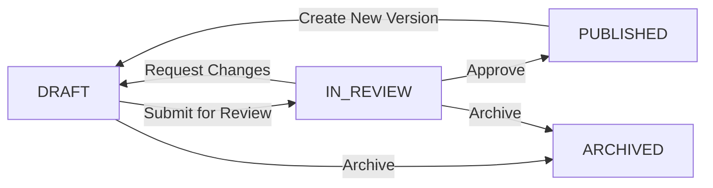

# Skills Locker - Product Specification

**Version:** 1.0  
**Last Updated:** 20 January 2026  
**Status:** Student UI Complete → Admin Backend Planning

---

## Executive Summary

Skills Locker is a cloud-based Learning Management System (LMS) purpose-built for **Fit College** to deliver short, practical fitness education. The platform supports three content tiers (Training Bytes, Microcreds, Short Courses) across 15 specialized fitness domains.

**Current state:** Student-facing UI complete with 110 courses populated.  
**Next milestone:** Admin backend for course authoring, workflow management, and cohort administration.

---

## Product Vision

Enable Fit College to:
1. Rapidly author and publish high-quality, bite-sized fitness education
2. Manage course lifecycles from draft to publication
3. Deliver accredited and non-accredited content seamlessly
4. Track learner progress and cohort performance
5. Leverage AI-assisted authoring to accelerate content creation

---

## Content Tiers

| Tier | Duration | Accreditation | Assessments | Use Case |
|------|----------|---------------|-------------|----------|
| **Training Bytes** | 1 hour | No | Optional quizzes | Quick skill acquisition, CPD points |
| **Microcreds** | 1–2 days | Yes (default) | Required | Certifiable competencies |
| **Short Courses** | 1–3 weeks | No (default) | Mixed | Deeper learning pathways |

---

## Domain Taxonomy

15 specialized fitness domains with 110 total courses:

1. **Strength & Conditioning (S&C)** - 11 courses
2. **Nutrition** - 6 courses
3. **Fitness Business** - 9 courses
4. **Online Coaching** - 6 courses
5. **AI in Fitness** - 5 courses
6. **Mental Health & Fitness** - 9 courses
7. **Mindset Coaching** - 9 courses
8. **Typical Health Conditions** - 7 courses
9. **Women Specific Training** - 6 courses
10. **Disability Support** - 2 courses
11. **Functional Fitness** - 14 courses
12. **Advanced Hypertrophy** - 7 courses
13. **Power Training** - 8 courses
14. **Sport Coaching** - 0 courses *(reserved for future)*
15. **Outdoor Group Training** - 11 courses

---

## Data Model

### Core Entities

#### Domain
```typescript
{
  id: string;           // unique identifier
  name: string;         // display name
  partners: string[];   // industry partners/contributors
}
```

#### Course Item
```typescript
{
  id: string;                      // unique identifier
  domainId: string;                // → domains.id
  tier: "BYTE" | "MICROCRED" | "SHORT";
  title: string;
  durationLabel: string;           // "1 hr", "1–2 days", "1–3 weeks"
  accredited: boolean;
  outcomes: string[];              // 3–4 learning outcomes
  prerequisites: string[];         // course IDs
  
  // Admin-only fields (to be added)
  status: "DRAFT" | "IN_REVIEW" | "PUBLISHED";
  versionNumber: number;
  lastPublishedAt?: Date;
  changelog?: string;
  
  // Full course structure (to be added)
  modules?: Module[];
}
```

#### Module (to be implemented)
```typescript
{
  id: string;
  title: string;
  description: string;
  order: number;
  lessons: Lesson[];
  completionCriteria: CompletionRule;
}
```

#### Lesson (to be implemented)
```typescript
{
  id: string;
  title: string;
  order: number;
  blocks: Block[];
  completionCriteria: CompletionRule;
}
```

#### Block (to be implemented)
```typescript
{
  id: string;
  type: "VIDEO" | "TEXT" | "FILE" | "CHECKLIST" | 
        "REFLECTION" | "LINK" | "QUIZ" | "ASSIGNMENT";
  order: number;
  content: any;  // type-specific content
}
```

---

## User Roles & Permissions

| Role | Permissions |
|------|-------------|
| **ADMIN** | Full system access, manage all courses, users, settings |
| **EDITOR** | Create/edit courses in assigned domains, submit for review |
| **REVIEWER** | Review courses, request changes, approve for publication |
| **ASSESSOR** | Grade assignments, provide feedback, manage rubrics |
| **LEARNER** | Enrol in courses, complete content, receive certificates |

---

## Course Lifecycle Workflow



**Publish Checklist Requirements:**
- ✅ All mandatory metadata complete (title, domain, tier, outcomes)
- ✅ At least one module with content
- ✅ Assessments configured (if required for tier)
- ✅ Prerequisites valid (no circular dependencies)
- ✅ All media assets uploaded and accessible

---

## Admin Backend Feature Breakdown

### MVP (Phase 1) - Priority Features

#### 1. Course Management
- **List View** with filters (Domain, Tier, Status) and search
- **Create/Edit** metadata (title, tier, domain, outcomes, prerequisites)
- **Status transitions** (DRAFT → IN_REVIEW → PUBLISHED)
- **Versioning** (track changes, changelog)

#### 2. Course Builder
- **Module management** (add, edit, reorder, delete)
- **Lesson management** (add, edit, reorder, delete)
- **Block editor** with supported types:
  - Video (upload/embed)
  - Text (rich text editor)
  - File (PDF, documents)
  - Checklist (task list)
  - Reflection (open-ended prompt)
  - Link (external resource)
  - Quiz (MCQ, true/false, short answer)
  - Assignment (submission + grading)

#### 3. Question Bank & Assessments
- **Question library** (tagged, reusable questions)
- **Quiz builder** (drag-and-drop from question bank)
- **Auto-grading** for objective question types
- **Manual grading** workflow for assignments

#### 4. Cohort Management
- **Create cohorts** (name, start date, courses assigned)
- **Enrol learners** (bulk upload CSV or individual add)
- **Progress tracking** (completion rates, assessment scores)

#### 5. User Management
- **Role assignment** (ADMIN, EDITOR, REVIEWER, ASSESSOR, LEARNER)
- **Permission enforcement** (UI + API layer)

---

### Phase 2 - Premium Features

#### 1. Asset Library
- Centralized media repository
- Reusable across courses
- Tagging and search

#### 2. Advanced Assessment Tools
- **Rubrics** for subjective grading
- **Assessor workflows** (assign, grade, feedback templates)
- **Peer review** capabilities

#### 3. Certificates & Accreditation
- Auto-generate certificates on completion
- Configurable pass requirements (completion + score threshold)
- Digital badge integration

#### 4. Analytics & Reporting
- **Learner analytics:** Progress, time-on-task, drop-off points
- **Course analytics:** Completion rates, assessment difficulty
- **Cohort comparison** dashboards

---

### Phase 3 - AI-Assisted Authoring

Integrated directly into the **Course Builder** interface.

#### AI Actions
1. **Generate Course Outline** from brief description + outcomes
2. **Draft Lesson Content** from learning objectives
3. **Generate Quiz** from lesson content
4. **Summarize Module** for learner preview
5. **Improve Clarity & Inclusivity** (content refinement)

#### AI Output Rules
- ✅ **Strict JSON schema** matching course structure
- ✅ **Preview diff** (show changes before applying)
- ✅ **Explicit Apply** (user must confirm)
- ❌ **No auto-commit** of AI-generated content

---

## Technical Architecture (High-Level)

### Frontend
- **Framework:** (TBD - match existing student UI, likely React-based)
- **Routing:** Client-side routing (`/admin/*` routes)
- **State Management:** (TBD - likely Context API or lightweight state library)
- **Design System:** Maintain existing student UI design tokens (colors, typography, spacing)
- **Rich Text:** TinyMCE or similar for lesson content
- **Drag & Drop:** For module/lesson/block reordering

### Backend / Data Layer
- **Current:** In-memory / localStorage (JSON)
- **Future:** Firebase, Supabase, or custom API (migration path)
- **Data Model:** TypeScript interfaces (strict typing)

### Authentication & Authorization
- **Roles:** ADMIN, EDITOR, REVIEWER, ASSESSOR, LEARNER
- **Route Guards:** Protect `/admin/*` routes
- **Data Permissions:** Role-based access to edit/publish/delete

### AI Integration
- **Model:** Gemini API (Google AI Studio)
- **Prompt Engineering:** Strict JSON output schemas
- **Content Generation:** Preview → Review → Apply workflow

---

## Design Principles

1. **Maintain Student UI Aesthetic** - Do not redesign student-facing flows
2. **Admin UX = Power + Simplicity** - Advanced features, intuitive interface
3. **Progressive Disclosure** - Show complexity only when needed
4. **Mobile-Friendly** - Responsive admin interface (tablet+)
5. **Accessibility** - WCAG 2.1 AA compliance

**Design Inspiration:** [Inclusive AF](https://inclusiveaf.com) - vibrant, modern, approachable

---

## Success Metrics (MVP)

An admin user should be able to:

1. ✅ Log in and access admin dashboard
2. ✅ Create a new course from scratch in < 5 minutes (metadata only)
3. ✅ Build a complete module (3 lessons, mixed block types) in < 30 minutes
4. ✅ Add assessments from question bank in < 10 minutes
5. ✅ Submit course for review and publish (if approved)
6. ✅ Create a cohort, assign course, enrol 20 learners
7. ✅ View cohort progress report

---

## Known Constraints & Gotchas

### 1. Data Import Formatting
- ❌ **Row-style tables** (pipe/semicolon delimited) cause silent data loss
- ✅ **Domain blocks** (explicit lists) + coverage validation required for bulk imports

### 2. Partner/Contributor Assignment
- Current: Placeholders randomly assigned from domain partners list
- Future: Explicit contributor assignment per course

### 3. Prerequisite Validation
- Must prevent circular dependencies
- Display visual prerequisite chain in UI

### 4. Version Control
- Each edit should NOT create a new version
- Only "Publish" action increments version number

---

## Open Questions (For User Clarification)

1. **Authentication provider:** Firebase Auth, Auth0, custom, or existing system?
2. **File storage:** Where should media assets (videos, PDFs) be stored?
3. **Email notifications:** Should system send emails for course review/publish events?
4. **Learner enrollment:** Self-enroll vs admin-assigned only?
5. **Payment integration:** Required for MVP or Phase 2?

---

## Next Steps

1. ✅ Review and approve this product spec
2. ⏳ Create detailed implementation plan for admin backend MVP
3. ⏳ Define tech stack and architecture decisions
4. ⏳ Build admin shell + authentication
5. ⏳ Implement course management (list/create/edit)
6. ⏳ Implement course builder UI
7. ⏳ Implement assessments + question bank
8. ⏳ Implement cohort management
9. ⏳ Testing & QA
10. ⏳ Deploy admin backend to production

---

**Document Owner:** Antigravity AI  
**Stakeholder:** Fit College / FC-MBL  
**Status:** Draft - Awaiting Review
